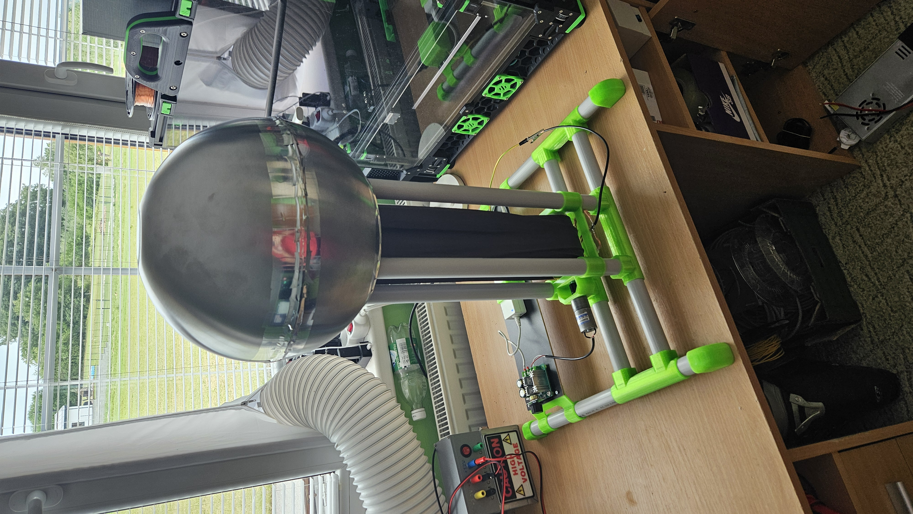

# Van-De-Graaff Generator

Made as part of Arcade Hack Club

Used github copilot when writing README

This project is my take on the Van-De-Graaff Generator. 
It is a device that produces high voltage static electricity using the triboelectric effect.
I tried to make it as cheap and simple as possible, using mainly components that can be found in any hardware store.

#########Video here##########

## How it works
The device works by spinning a belt made of nylon (pantyhose from my moms drawer) around a stationary PVC pipe.
This rubbing action creates a positive charge on the PVC pipe, this charge is then transferred to a metal sphere on top of the device via a closeby brush.
The belt gets negativeley charged and deposits the charge on the bottom of the device, which is connected to the ground thru a second brush.

## Parts
For the generator itself:

- at least 4m of 25mm diameter PVC pipe
- 0.1m of 50mm diameter PVC pipe
- 0.15m of 15mm diameter PVC pipe
- 1.5kg of PETG filament
- some TPU filament for the bottom roller (you can use PETG, and glue some rubber to it)
- a pair of nylone pantyhoses
- for the top sphere: you can get pre-made one, but those can be expensive. I made mine from two almost round 28cm diameter IKEA BLANDA BLANK bowls taped together with aluminum tape
- some wire for the brushes
- a small motor (I used a 6V DC motor running at 12V to get enough torque)
- a 12V power supply
- DC motor controller
- C13 socket
- 150cm of M8 threaded rod
- 2x M8 Lock nuts
- 2x20 Hardened steel pin
- Some M3 screws
- some threaded inserts
- 2 608 bearings

If you want to build the optional ground ball:
- at least 4m of 25mm diameter PVC pipe
- for the sphere: same as the top sphere, but you can use a smaller size bowl (I used 12cm diameter)
- some PETG filament
- some wire

## Assembly

### Base

1. Cut the 25mm PVC pipe to 4 pieces of 40cm each.
2. Joint them together with 4 printed T-joints.

3. Cut the 50mm PVC pipe to 4 more pieces of 60cm each.
4. Insert them into the base T-joints.

### Motor mount
1. Insert the 608 bearings into the holders
2. Drill a cross hole at the end of the threaded rod
3. Insert the rod and motor into the printed coupler and fasten the rod with a pin
4. Attach the motor with 2 M3x8 screws. to its mount
5. Slide the lock nuts into the printed roller and use some force to screw the rod into the roller
5. Slide on the bearing holders

### Belt
1. Cut the pantyhose to 2 pieces of 55cm each
2. Sew them together to make the belt
3. Cut off any excess material at the seams

### Brushes
1. Strip some stranded wire
2. Hotglue 3-5 bundles to the brush holder
3. Solder the ends to a longer wire and leave some slack
4. Repeat for the other brush (you can make more brushes if you want)

### Top roller
1. Cut the 50mm PVC pipe to 10cm (you might need to shorten it later to make it fit)
2. Inser the two printer holders into it
3. Cut the 15mm PVC pipe to 12cm (you might need to shorten it later to make it fit)
4. Insert it into printed holder
5. Insert the entire assembly into the two printed holders
6. Make sure nothing can rotate - these parts are all press-fit and must remain stationary
7. Use glue if necessary to make it all stay together

### Top sphere
If you went the DIY route, this is the most difficult part.
1. Take one of the bowls use and angle grinder to cut a 17-18cm diameter hole in the bottom and make sure to save the cutout piece
2. Tape the two bowls together with aluminum tape (I suggest using a small piece of tape to not get many wrinkles)
3. Use a piece of wire insulation to cover the sharp edge of the bowl

5. (optional) Cover the wire with aluminum tape
6. Glue the cutout piece to the printed holder (you might need add the printed spacers to raise the sphere)

### Base plate and electronics
1. Slide the base plate mounts onto the base
2. Add 4 heat inserts to the base plate mounts
3. Screw the base plate to the mounts

:warning:    :warning:    :electric_plug:    :warning:     :warning: 

Warning: This parts includes mains voltage, if you are not a experienced electrician, skip this part and use a bench power supply instead.

:warning:    :warning:    :electric_plug:    :warning:     :warning: 

4. Attach the motor controller to the base plate
5. Attach power supply and C13 socket to the base plate
6. Connect everything together as schematics show exept for the motor

### Final assembly
This part can be a bit finicky with the belt alignment.
1. Slide the belt over the two rollers
2. Slide the components onto the pillars in this order (reference the CAD image)
- bottom brush
- motor mount with roller
- top brush (optional)
- top roller
- top brush
2. Connect the top brush to the top sphere cutout piece with aluminum tape

3. Place the top sphere holder on top of everything
4. Place the top sphere on top of the holder
5. Connect the motor to the motor controller
6. You are done!
7. Test it!

If you bring your hand close to the top sphere and feel a shock, it works!

## Ground ball (optional)
1. Cut the 25mm PVC pipe to 5 pieces of 22cm each and 1 piece of 35cm
2. Joint them together with 3 printed T-joints and 4 printed corners while passing a wire from the top to the middle bottom of one pipe (see CAD, I connectd mine thru a 3.5mm audio jack, would not recommend as it does not fit very well and its unnecessary)

3. Place the sphere holder on top of the pipes
4. Attach the wire to the sphere with aluminum tape
5. Place and glue the sphere on top of the holder
6. (optional) solder a aliigator clip to the other end of the wire

## Fine tuning
1. If the belt is too loose, you can try moving to rollers apart or shorten the belt.
2. Make sure to adjust the brushes so they are close to the belt (they dont have to touch it), but keep them oriented in the direction of the belt so that they dont catch on the seams.

3. Set the motor speed so that it has enough torque to spin the belt (more speed = more charge, but more wear on the belt)
4. Connect the bottom brush to ground or to the optional ground ball.
5. Remove any shap edges on the sphere to prevent corona discharge.

I was able to achive 5-6cm sparks with this setup (around 150-200kV), but I have not spent much time tweaking it, so you might be able to get more out of it.
